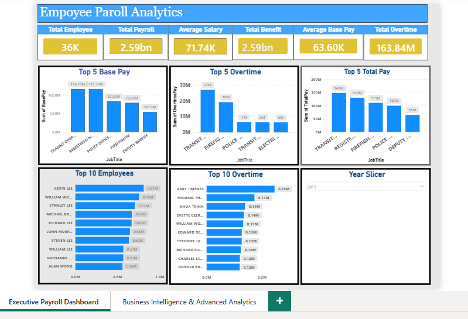
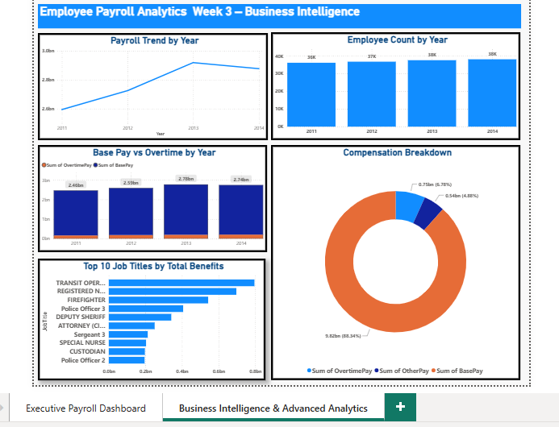

# 📊 Employee Payroll Analytics Dashboard

> **An end-to-end Power BI analytics project transforming over 148,000 employee payroll records into actionable business intelligence for Finance, HR, and Executive Management.**


---

# 📑 Table of Contents

- [Project Overview](#project-overview)
- [Business Problem](#business-problem)
- [Project Objectives](#project-objectives)
- [Dashboard Preview](#dashboard-preview)
- [Key Performance Indicators](#key-performance-indicators)
- [Dataset Information](#dataset-information)
- [Tools & Technologies](#tools--technologies)
- [Data Preparation](#data-preparation)
- [Dashboard Features](#dashboard-features)
- [Key Business Insights](#key-business-insights)
- [Business Recommendations](#business-recommendations)
- [Repository Structure](#repository-structure)
- [Skills Demonstrated](#skills-demonstrated)
- [Future Improvements](#future-improvements)
- [About the Author](#about-the-author)

---

# 📌 Project Overview

Payroll is one of the largest operational expenses in most organizations. While payroll systems store extensive employee compensation data, they often provide limited analytical insight for executive decision-making.

This project demonstrates the complete analytics lifecycle using **Microsoft Power BI**, transforming raw payroll data into interactive dashboards that support strategic decisions in Human Resources, Finance, and Executive Management.

---

# 🎯 Business Problem

Management required answers to critical questions such as:

- How much is being spent on payroll?
- Which employees receive the highest compensation?
- Which job roles account for the largest payroll costs?
- How much of payroll is overtime?
- How has payroll changed over time?
- Which compensation components drive overall payroll expenditure?

---

# 🎯 Project Objectives

- Clean and validate payroll data
- Transform data using Power Query
- Build DAX measures and KPIs
- Design executive dashboards
- Analyze workforce compensation
- Generate actionable business insights

---

# 🖼 Dashboard Preview

## Executive Dashboard



---

## Business Intelligence Dashboard



---

# 📈 Key Performance Indicators

The dashboard monitors:

- 👥 Total Employees
- 💰 Total Payroll
- 📊 Average Salary
- 🎁 Average Benefits
- 💵 Base Pay
- ⏰ Overtime Pay
- 💳 Other Pay
- 📈 Payroll Trend by Year
- 📅 Employee Count by Year

---

# 📂 Dataset Information

**Dataset:** Employee Payroll

**Records:** 148,654

### Key Fields

- Employee Name
- Job Title
- Base Pay
- Overtime Pay
- Other Pay
- Total Pay
- Total Pay Benefits
- Year
- Agency

---

# 🛠 Tools & Technologies

| Tool | Purpose |
|-------|---------|
| Microsoft Power BI | Dashboard Development |
| Power Query | Data Cleaning & Transformation |
| DAX | Business Calculations |
| Microsoft Excel | Data Review |
| GitHub | Project Documentation |

---

# 🔄 Data Preparation

The data preparation process included:

- Data Profiling
- Missing Value Assessment
- Duplicate Inspection
- Data Validation
- Data Type Correction
- Data Transformation

---

# 📊 Dashboard Features

### Executive Dashboard

- KPI Cards
- Top 5 Job Titles by Base Pay
- Top 5 Job Titles by Overtime Pay
- Top 10 Highest Paid Employees
- Interactive Year Slicer

### Business Intelligence Dashboard

- Payroll Trend by Year
- Employee Count by Year
- Base Pay vs Overtime
- Compensation Breakdown
- Top Job Titles by Benefits

---

# 💡 Key Business Insights

- Payroll expenditure increased steadily before stabilizing.
- Base Pay represents the largest share of employee compensation.
- Overtime contributes a relatively small percentage of total payroll.
- Executive and specialist roles account for the highest compensation levels.
- Interactive dashboards significantly improve payroll transparency and executive reporting.

---

# ✅ Business Recommendations

- Monitor overtime costs regularly.
- Benchmark high-cost job roles.
- Strengthen payroll governance.
- Use dashboard insights during budget planning.
- Expand the solution with predictive payroll forecasting.

---

# 📁 Repository Structure

```text
employee-payroll-analytics-dashboard
│
├── Employee-Payroll-Analytics.pbix
├── Employee Payroll.xlsx
├── Employee Payroll Analytics Report.pdf
├── executive-dashboard.png
├── business-intelligence-dashboard.png
├── README.md
└── LICENSE
```

---

# 🚀 Skills Demonstrated

- Data Cleaning
- Data Validation
- Power Query
- DAX
- Data Modeling
- Dashboard Design
- Payroll Analytics
- HR Analytics
- Business Intelligence
- Executive Reporting
- Data Storytelling

---

# 🔮 Future Improvements

- Department-Level Analysis
- Payroll Forecasting
- Budget vs Actual Payroll Dashboard
- HR Workforce Analytics
- Predictive Compensation Modelling

---

# 👤 About the Author

## Patrick Azukaego Ashibuogwu, ACA

**Data Analytics Professional | Chartered Accountant | Business Intelligence Enthusiast**

With over 30 years of leadership experience in finance, audit, risk management, and internal controls, I combine deep business expertise with modern analytics tools to transform complex data into actionable insights that support informed decision-making.

### Technical Skills

- Microsoft Power BI
- Power Query
- DAX
- Microsoft Excel
- SQL
- Python
- Data Visualization
- Business Intelligence

---

### 📫 Let's Connect

- GitHub: https://github.com/Patashib2025

*(Add your LinkedIn profile URL here once it is updated.)*

---

⭐ **If you found this project useful, please consider giving it a star.**
